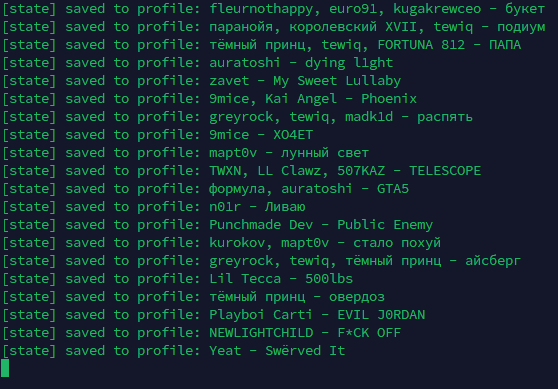
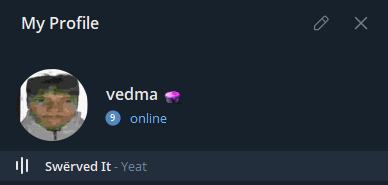

# spot2gram

Синхронизирует текущий трек из Spotify в музыкальный статус Telegram. Использует Telegram-бота для получения трека и Spotify Web API.

> 🇪🇳 README in english available [here](README.md)

Спасибо Telegram боту [@playinnowbot](https://t.me/playinnowbot) за возможность скачивать треки.




## Как это работает
- Проверяет, играет ли что-то в Spotify прямо сейчас
- Если играет, ищет трек через бота и добавляет его в ваш музыкальный статус Telegram
- Убирает предыдущий трек из статуса, когда он останавливается или трек меняется

## Требования
- [Python](https://www.python.org/downloads/) 3.10+

## Создание приложения в Spotify
1. Откройте Spotify Developer Dashboard (`https://developer.spotify.com/dashboard`)
2. Создайте приложение
3. В настройках приложения добавьте Redirect URI: `http://127.0.0.1:8888/callback`
4. Сохраните изменения
5. Скопируйте `Client ID` и `Client Secret` и укажите их в `.env`

## Настройка Telegram
1. Запустите Telegram-бота [@playinnowbot](https://t.me/playinnowbot)
2. Привяжите аккаунт Spotify в боте
3. Создайте новый Telegram-канал, в котором будут треки
4. Получите ID канала и укажите его в `.env` (обычно ID начинается с `-100`. Если у вас без `-100`, добавьте префикс `-100` сами)

## Быстрый старт

Клонируйте репозиторий и перейдите в папку проекта:
```bash
git clone https://github.com/vedma1337/spot2gram.git
cd spot2gram
```

### Linux
```bash
python3 -m venv venv
source venv/bin/activate
pip3 install -r requirements.txt
cp .env-example .env
nano .env  # заполните SPOTIFY_CLIENT_ID, SPOTIFY_CLIENT_SECRET, SPOTIFY_REDIRECT_URI, CHANNEL_ID

# получите refresh token
python3 spotify_auth.py

nano .env # вставьте SPOTIFY_REFRESH_TOKEN, полученный из скрипта

# Запуск
python3 main.py
```

### Windows (PowerShell)
```powershell
python -m venv venv
venv\Scripts\Activate.ps1
pip install -r requirements.txt
copy .env-example .env
# откройте .env и заполните SPOTIFY_CLIENT_ID, SPOTIFY_CLIENT_SECRET, SPOTIFY_REDIRECT_URI, CHANNEL_ID

# Получить refresh token
python spotify_auth.py

# откройте .env снова и вставьте SPOTIFY_REFRESH_TOKEN, полученный из скрипта

# Запуск
python main.py
```

## Настройка .env
Скопируйте `.env-example` в `.env` и заполните значения:
```ini
SPOTIFY_CLIENT_ID=your_spotify_client_id
SPOTIFY_CLIENT_SECRET=your_spotify_client_secret
SPOTIFY_REFRESH_TOKEN=  # заполните после запуска spotify_auth.py
SPOTIFY_REDIRECT_URI=http://127.0.0.1:8888/callback
CHANNEL_ID=your_telegram_channel_id
POLL_INTERVAL_SECONDS=5
```

## Переменные окружения
- `SPOTIFY_CLIENT_ID`, `SPOTIFY_CLIENT_SECRET`: из вашего приложения Spotify
- `SPOTIFY_REFRESH_TOKEN`: получаем через `spotify_auth.py`
- `SPOTIFY_REDIRECT_URI`: по умолчанию `http://127.0.0.1:8888/callback`
- `CHANNEL_ID`: числовой ID чата/канала, куда отправится inline-результат (можно избранные или приватный канал, лучше отдельный и приватный канал)
- `POLL_INTERVAL_SECONDS`: частота опроса Spotify в секундах

> [!NOTE]
> Если refresh token не вернулся, удалите доступ приложения в аккаунте Spotify (Apps) и повторите авторизацию.
> Redirect URI должен быть строго `http://127.0.0.1:8888/callback` и в настройках приложения, и в `.env`.

